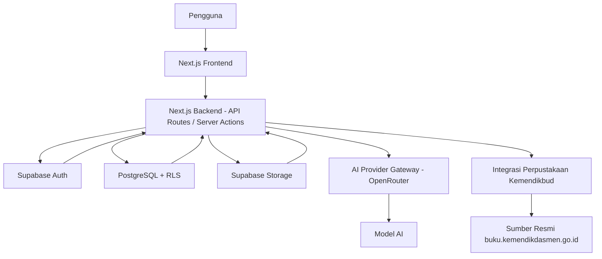
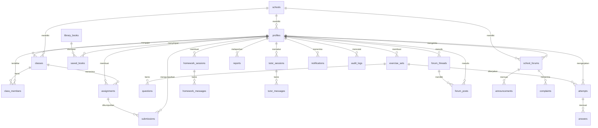

# PRD — Project Requirements Document

## 1. Overview

Aplikasi ini adalah platform belajar web terpadu untuk siswa SD, SMP, SMA, guru, dan admin sekolah. Saat ini siswa harus berpindah-pindah antara Google, WhatsApp, dan aplikasi lain untuk mencari buku, bertanya soal PR, berdiskusi, dan mengumpulkan tugas. Sering kali informasi yang didapat tidak sesuai jenjang, tidak jelas sumbernya, atau tidak aman untuk anak.

Tujuan utama aplikasi ini adalah menyediakan satu tempat yang aman dan terorganisir untuk:

- mencari buku dari sumber resmi Kemendikbud;
- membuat latihan soal dan kuis berbantuan AI;
- mendapatkan bantuan PR dengan petunjuk, bukan jawaban instan;
- berdiskusi sesuai jenjang dan di bawah pengawasan;
- mengelola tugas dan penilaian antara guru dan siswa;
- memberi pendampingan belajar pribadi melalui tutor AI yang aman.

Produk ini dirancang mobile-first, modern, sederhana, dan aksesibel, dengan perlindungan data anak sebagai prioritas.

---

## 2. Requirements

### Fungsional
- Mendukung peran **siswa SD/SMP/SMA**, **guru**, dan **admin sekolah**.
- Setiap pengguna memiliki profil dengan jenjang dan sekolah.
- Dashboard berbeda untuk setiap peran.
- Pencarian dan filter konten, notifikasi, serta audit log.
- Semua fitur pada roadmap fase 1–5 harus tersedia sesuai urutan fase.

### Keamanan & Kepatuhan
- Autentikasi aman dengan Supabase Auth.
- PostgreSQL dengan **Row Level Security (RLS)** yang ketat.
- Validasi input di sisi server, rate limiting, dan tidak mengekspos API key ke browser.
- Perlindungan khusus pengguna anak: konten difilter, diskusi dipisah per jenjang, dan ada mekanisme pelaporan.
- Integrasi perpustakaan dari Kemendikbud hanya mengambil metadata dan menautkan ke sumber asli; tidak menyalin konten berhak cipta. Jika API resmi tidak tersedia, proses diarahkan agar mematuhi robots.txt dan ketentuan situs.

### Deliverable
- Skema database lengkap.
- Kebijakan RLS yang ketat untuk semua tabel.
- Seed data contoh: 1 SD, 1 SMP, 1 SMA, siswa, guru, admin, buku, forum, tugas, dan kuis.
- File `.env.example` dan dokumentasi setup.
- Pengujian pada fitur utama: generator soal, perpustakaan, bantuan PR, forum, dan tugas.
- Kode siap dijalankan dan di-deploy ke Vercel.

---

## 3. Core Features

### Fase 1

#### Beranda
- **Ringkasan Progres** — Menampilkan perkembangan belajar, nilai kuis, dan aktivitas terbaru dalam bentuk ringkas.
- **Akses Cepat** — Tombol langsung untuk buat soal, bantuan PR, cari buku, dan diskusi.
- **Notifikasi & Pengumuman** — Pemberitahuan tugas, forum, dan pengumuman sekolah dalam satu daftar.
- **Pencarian Global** — Mencari materi, soal, buku, dan percakapan langsung dari kolom pencarian di beranda.

#### Generator Latihan Soal
- **Atur Parameter Soal** — Pilih jenjang, kelas, mata pelajaran, topik, kesulitan, dan jumlah soal sebelum membuat latihan.
- **Kerjakan Soal** — Menjawab soal pilihan ganda atau esai dengan tampilan yang mudah digunakan.
- **Kunci & Pembahasan** — Melihat kunci jawaban dan penjelasan setiap soal setelah latihan selesai.
- **Rekap Nilai & Riwayat** — Menyimpan hasil latihan dan menampilkan perkembangan nilai dari waktu ke waktu.

### Fase 2

#### Bantuan PR
- **Kirim Pertanyaan** — Mengetik soal atau mengunggah foto soal.
- **Petunjuk Bertahap** — Menerima petunjuk langkah demi langkah, bukan langsung jawaban akhir.
- **Penjelasan Sesuai Usia** — Menggunakan bahasa yang sesuai untuk SD, SMP, atau SMA.
- **Riwayat Bantuan** — Menyimpan percakapan bantuan PR agar bisa dibuka kembali.

#### Perpustakaan Digital
- **Cari Buku** — Menemukan buku berdasarkan judul, jenjang, atau kategori.
- **Filter Koleksi** — Menyaring buku berdasarkan jenis, jenjang, dan mata pelajaran.
- **Detail & Sumber Asli** — Menampilkan informasi buku, penulis, dan tautan menuju sumber resmi tanpa menyalin konten.
- **Koleksi Tersimpan** — Menyimpan buku favorit agar mudah diakses kembali.

### Fase 3

#### Ruang Diskusi & Forum
- **Diskusi Antarjenjang** — Siswa hanya bisa berdiskusi dengan siswa dari jenjang yang sama.
- **Forum Terbuka** — Diskusi umum yang melibatkan siswa dan guru dari berbagai jenjang.
- **Forum Sekolah** — Diskusi internal satu sekolah, termasuk pengumuman dan pengajuan masalah dengan status tindak lanjut.
- **Kelola Forum Sekolah** — Admin sekolah membuat dan mengelola ruang forum sekolah, termasuk mengangkat moderator.
- **Moderasi & Pelaporan** — Moderasi AI dan manual untuk bahasa kasar, SARA, perundungan, spam, doxxing, dan konten berbahaya.

#### Tugas & Penilaian
- **Buat & Kirim Tugas** — Guru menyusun tugas, menentukan tenggat, dan mengirimkannya ke kelas atau murid tertentu.
- **Kumpulkan Tugas** — Siswa mengirim jawaban berupa teks atau file.
- **Nilai & Komentar** — Guru memberikan nilai, umpan balik, dan menandai status pengumpulan.
- **Tenggat & Pengingat** — Menampilkan tenggat tugas dan mengirim pengingat sebelum waktu kumpul habis.

### Fase 4

#### Tutor AI Pribadi
- **Sesi Tanya Jawab** — Mengobrol dengan AI untuk mempelajari topik tertentu secara personal.
- **Rekomendasi Materi** — Mendapat saran materi atau latihan berdasarkan nilai dan progres belajar.
- **Eskalasi ke Guru** — Meneruskan percakapan atau laporan ke guru jika AI tidak bisa membantu atau ada indikasi berbahaya.
- **Konten Aman** — Menyaring respons agar sesuai usia dan tidak menampilkan konten berbahaya.

### Fase 5

#### Akun & Keamanan
- **Daftar & Masuk** — Membuat akun dan login sesuai peran dengan autentikasi aman.
- **Profil & Pengaturan** — Mengisi jenjang, sekolah, dan preferensi akun.
- **Perlindungan Data Anak** — Menerapkan batasan privasi dan keamanan khusus pengguna di bawah umur.
- **Catatan Aktivitas** — Aplikasi mencatat log aktivitas untuk membantu admin memantau keamanan.
- **Keluar & Hapus Akun** — Mengakhiri sesi atau menghapus akun dengan prosedur aman.

---

## 4. User Flow

Berikut alur utama perjalanan pengguna:

1. **Pendaftaran dan profil**
   - Pengguna memilih peran: siswa, guru, atau admin sekolah.
   - Mengisi nama, jenjang, sekolah, dan kelas.
   - Sistem membuat profil dan mengarahkan ke dashboard sesuai peran.

2. **Membuat latihan soal**
   - Siswa masuk ke menu “Buat Soal”.
   - Memilih jenjang, kelas, mapel, topik, kesulitan, dan jumlah soal.
   - Klik “Buat Latihan”.
   - Sistem menampilkan soal; siswa mengerjakan.
   - Setelah selesai, siswa melihat nilai, kunci, pembahasan, dan riwayat.

3. **Mencari buku**
   - Siswa membuka menu Perpustakaan.
   - Mencari judul, mengisi filter jenjang/kategori/mapel.
   - Membuka detail buku, lalu menuju tautan sumber asli di kemendikdasmen.go.id.
   - Bisa menyimpan buku ke koleksi pribadi.

4. **Bantuan PR**
   - Siswa membuka menu Bantuan PR.
   - Mengetik soal atau mengunggah foto.
   - AI memberikan petunjuk bertahap sesuai usia.
   - Percakapan tersimpan di riwayat sehingga bisa dibuka lagi.

5. **Diskusi dan forum**
   - Siswa membuka Ruang Diskusi.
   - Sistem otomatis menampilkan forum sesuai jenjang dan sekolah.
   - Siswa membaca/membuat postingan dan dapat melaporkan konten yang tidak pantas.
   - Guru hanya melihat diskusi sesuai kewenangannya; admin sekolah mengelola forum sekolah.

6. **Mengelola tugas**
   - Guru membuat tugas, memilih kelas atau murid, dan menetapkan tenggat.
   - Siswa mendapat notifikasi dan mengumpulkan jawaban/file.
   - Guru memberi nilai dan komentar.

7. **Tutor AI pribadi**
   - Siswa memilih topik atau mapel.
   - AI membuka sesi tanya jawab, memberikan penjelasan sesuai progres.
   - Jika ada tanda bahaya, sesi dapat dieskalasi ke guru.

---

## 5. Architecture

Aplikasi menggunakan arsitektur frontend dan backend yang berada dalam satu proyek Next.js. Backend berjalan sebagai API Routes / Server Actions di sisi server. Semua komunikasi dengan AI dan sumber eksternal dilakukan dari server agar kunci API tidak pernah terlihat oleh pengguna.

Komponen utama:

- **Frontend**: Next.js + Tailwind CSS, tampilan mobile-first.
- **Backend**: Node.js via Next.js, berisi logika validasi, rate limit, dan integrasi AI.
- **Supabase**: menyediakan autentikasi, database PostgreSQL, storage untuk file, dan kebijakan RLS.
- **AI Provider Gateway**: abstraksi provider AI yang dapat dipanggil server-side.
- **Integrasi Perpustakaan**: server-side proxy ke situs Kemendikbud, mematuhi API/robots.txt.

Alur keamanan:

- Semua permintaan masuk diverifikasi sesi pengguna.
- Validasi input dilakukan di server.
- Rate limit diterapkan pada endpoint publik dan pembuatan konten.
- Database tidak bisa diakses langsung dari client; semua akses melalui RLS.
- API key AI hanya berada di environment variable server.

---

## 6. Database Schema

Sistem menggunakan PostgreSQL melalui Supabase. Akun pengguna dikelola oleh Supabase Auth, sedangkan data profil dan fitur disimpan dalam tabel berikut.

### Tabel utama

- **schools** — `id`, `name`, `address`, `created_at`  
  Menyimpan data sekolah.

- **profiles** — `id`, `user_id` (FK auth.users), `school_id`, `role`, `full_name`, `jenjang`, `grade`, `avatar_url`, `created_at`  
  Menyimpan profil siswa, guru, dan admin sekolah.

- **classes** — `id`, `school_id`, `teacher_profile_id`, `name`, `subject`, `grade`, `created_at`  
  Menyimpan kelas yang dibuat guru.

- **class_members** — `id`, `class_id`, `student_profile_id`, `joined_at`  
  Menghubungkan siswa ke kelas.

- **assignments** — `id`, `teacher_profile_id`, `class_id`, `student_profile_id`, `title`, `description`, `due_at`, `created_at`  
  Menyimpan tugas yang dikirim ke kelas atau murid tertentu.

- **submissions** — `id`, `assignment_id`, `student_profile_id`, `content_text`, `file_url`, `submitted_at`, `grade`, `feedback`, `graded_at`  
  Menyimpan jawaban siswa dan penilaian guru.

- **exercise_sets** — `id`, `student_profile_id`, `subject`, `topic`, `jenjang`, `grade`, `difficulty`, `question_count`, `score`, `created_at`  
  Menyimpan kuis/latihan yang dibuat berdasarkan parameter.

- **questions** — `id`, `exercise_set_id`, `type`, `text`, `options`, `correct_answer`, `explanation`, `order`  
  Menyimpan soal pilihan ganda atau esai.

- **attempts** — `id`, `exercise_set_id`, `student_profile_id`, `score`, `completed_at`  
  Menyimpan percobaan pengerjaan latihan.

- **answers** — `id`, `attempt_id`, `question_id`, `user_answer`, `is_correct`  
  Menyimpan jawaban per soal dalam satu percobaan.

- **library_books** — `id`, `title`, `author`, `category`, `jenjang`, `subject`, `source_url`, `source_name`, `cover_url`, `description`, `updated_at`  
  Menyimpan metadata buku dari Kemendikbud.

- **saved_books** — `id`, `student_profile_id`, `book_id`, `created_at`  
  Menyimpan buku favorit siswa.

- **homework_sessions** — `id`, `student_profile_id`, `title`, `status`, `created_at`  
  Menyimpan sesi bantuan PR.

- **homework_messages** — `id`, `session_id`, `role`, `content`, `hint_order`, `created_at`  
  Menyimpan percakapan bantuan PR.

- **tutor_sessions** — `id`, `student_profile_id`, `subject`, `status`, `created_at`  
  Menyimpan sesi tutor AI pribadi.

- **tutor_messages** — `id`, `session_id`, `role`, `content`, `created_at`  
  Menyimpan percakapan tutor AI.

- **forum_threads** — `id`, `author_profile_id`, `audience_jenjang`, `category`, `title`, `body`, `created_at`  
  Menyimpan topik diskusi/forum.

- **forum_posts** — `id`, `thread_id`, `author_profile_id`, `content`, `moderation_status`, `created_at`  
  Menyimpan postingan dalam forum.

- **reports** — `id`, `reporter_profile_id`, `target_type`, `target_id`, `reason`, `status`, `handled_by_profile_id`, `created_at`  
  Menyimpan laporan konten atau pengguna.

- **school_forums** — `id`, `school_id`, `name`, `description`, `created_by_profile_id`, `created_at`  
  Menyimpan forum internal sekolah.

- **announcements** — `id`, `school_forum_id`, `title`, `body`, `created_by_profile_id`, `created_at`  
  Menyimpan pengumuman sekolah.

- **complaints** — `id`, `school_forum_id`, `student_profile_id`, `title`, `description`, `visibility`, `status`, `resolution_note`, `created_at`  
  Menyimpan pengajuan masalah privat/public dan status tindak lanjut.

- **notifications** — `id`, `user_id`, `type`, `message`, `read_at`, `link`, `created_at`  
  Menyimpan notifikasi pengguna.

- **audit_logs** — `id`, `actor_profile_id`, `action`, `target_type`, `target_id`, `ip_address`, `created_at`  
  Mencatat aktivitas penting untuk keamanan.

### Relasi tabel

### RLS

Setiap tabel memiliki kebijakan RLS yang ketat:

- **Siswa** hanya bisa membaca dan mengubah data miliknya sendiri.
- **Siswa SD** hanya melihat forum SD, siswa SMP hanya forum SMP, siswa SMA hanya forum SMA.
- **Guru** hanya melihat kelas, tugas, dan forum sesuai sekolahnya.
- **Admin sekolah** dapat mengelola forum sekolah, pengumuman, dan melihat audit log.

---

## 7. Tech Stack

### Frontend
- **Next.js** + **TypeScript**
- **Tailwind CSS**
- **shadcn/ui** untuk komponen antarmuka yang aksesibel dan modern

### Backend
- **Node.js** melalui Next.js API Routes / Server Actions
- **Supabase** sebagai backend service:
  - **Supabase Auth** untuk autentikasi
  - **PostgreSQL** untuk database
  - **Supabase Storage** untuk unggahan jawaban tugas
  - **Supabase RLS** untuk keamanan data
- **Drizzle ORM** untuk skema dan migrasi database
- **Rate limiting** dan validasi input di sisi server

### AI
- **AI Provider / Gateway:** OpenRouter
- AI diakses melalui abstraksi provider di server-side; API key hanya disimpan di environment variable dan tidak pernah dikirim ke browser.
- Model AI dapat disesuaikan per kebutuhan: pembuatan soal, bantuan PR, tutor, dan moderasi forum.

### Integrasi Eksternal
- Integrasi server-side dengan `https://buku.kemendikdasmen.go.id/` menggunakan API resmi jika tersedia; jika tidak, mematuhi robots.txt dan tetap menampilkan sumber serta tautan asli.

### Deployment
- **Vercel** untuk hosting frontend dan backend
- **Supabase** untuk database, autentikasi, storage, dan RLS
- File `.env.example` berisi semua variabel yang dibutuhkan, seperti koneksi Supabase dan API key AI server-side.